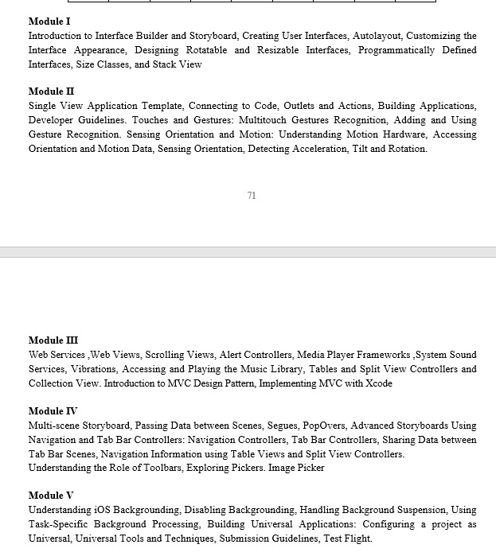
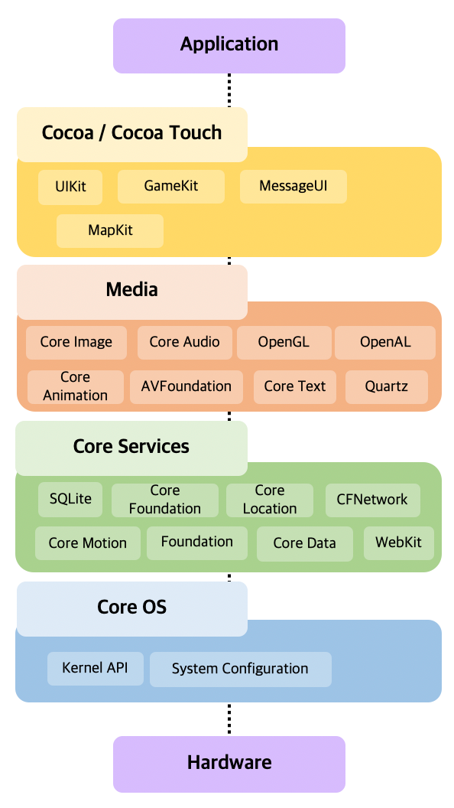
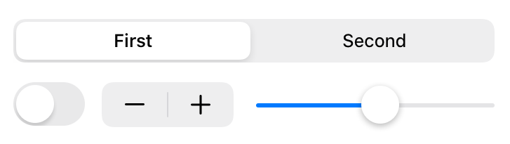
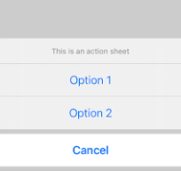

# iOS Storyboard & Interface Builder - Study Guide

A comprehensive guide covering the most important iOS development concepts for beginners.



---

## 📚 Table of Contents

- [Most Important Questions](#most-important-questions)
- [Info.plist](#infoplist)
- [Interface Builder](#interface-builder)
- [Storyboard](#storyboard)
- [iOS Architecture Layers](#ios-architecture-layers)
- [Touches vs Gestures](#touches-vs-gestures)
- [Global Thread vs Main Thread](#global-thread-vs-main-thread)
- [Cocoa Touch Framework](#cocoa-touch-framework)
- [Value Change Controls](#value-change-controls)
- [UI Components Deep Dive](#ui-components-deep-dive)
  - [UITextField vs UITextView](#uitextfield-vs-uitextview)
  - [Alert vs Action Sheet](#alert-vs-action-sheet)
  - [IBAction vs IBOutlet](#ibaction-vs-iboutlet)
- [Navigation](#navigation)
  - [UINavigationController](#uinavigationcontroller)

---

## 🎯 Most Important Questions (Chapter 1)

These are the most frequently asked questions in exams:

1. **What is Info.plist? Why is it used in iOS applications?**
2. **Briefly explain Interface Builder and Storyboard in iOS.**
3. **Differentiate between touches and gestures in iOS.**
4. **Differentiate between Global thread and Main thread.**
5. **Explain the architecture of iOS (layers).**
6. **What is the Cocoa Touch framework? Give examples.**

> 💡 **Pro Tip:** Mastering these 6 questions will help you answer most short and long questions from Unit 1.

---

## 📄 Info.plist

### What is Info.plist?

**Info.plist (Information Property List)** is a configuration file present in every iOS application. It stores key-value information that instructs the iOS system on how the app should run.

### Purpose and Uses

- Defines **basic app information** (app name, version, bundle identifier)
- Stores **permissions** (camera, location, microphone, Bluetooth, etc.)
- Configures **launch screen, app icons, and supported device orientations**
- Read by the system **before app launch** to establish required rules

### Common Info.plist Keys

| Key | Purpose |
|-----|---------|
| `CFBundleDisplayName` | App name displayed on device |
| `NSCameraUsageDescription` | Request permission for camera access |
| `UILaunchStoryboardName` | Specifies the launch screen storyboard |

### Example Values

```xml
<key>CFBundleDisplayName</key>
<string>My Awesome App</string>

<key>NSCameraUsageDescription</key>
<string>This app needs camera access to take photos</string>
```

> **Summary:** Info.plist is the identity and permissions rulebook of an iOS app. Without correct settings, an app may not run or access device features.

---

## 🛠️ Interface Builder

### What is Interface Builder?

**Interface Builder (IB)** is a visual UI design tool integrated into Xcode that enables developers to create and arrange user interfaces for iOS apps without writing layout code. It provides a drag-and-drop environment, making UI design faster and more intuitive.

### Where is it Used?

- **Storyboard (.storyboard)** files
- **XIB (.xib)** files

Both file types use Interface Builder for visual screen design.

### Key Features

| Feature | Description |
|---------|-------------|
| **Drag-and-drop UI elements** | Add labels, buttons, text fields, images, etc., directly onto screens |
| **Live Preview** | Visualize app layout across different screen sizes |
| **Auto Layout Support** | Create responsive UIs for all devices (iPhone, iPad) using constraints |
| **Connect UI to Swift Code** | Link UI elements via **IBOutlet** (properties) and **IBAction** (events) |
| **Inspectors** | Modify text, colors, fonts, and more through Attribute Inspector |

### Why Interface Builder Matters

1. **Faster UI Development** — Eliminates manual layout coding
2. **Easy Maintenance** — Visual layouts are simpler to modify
3. **Beginner-Friendly** — Build UIs with minimal coding knowledge
4. **Real-time Preview** — Instant layout visualization across devices
5. **Complex UI Support** — Easily manage auto layout, constraints, stack views, and animations

### Connecting UI to Code

To use UI elements in Swift code, create:

- **IBOutlet** → Read/modify UI element properties (e.g., `label.text`)
- **IBAction** → Handle user interactions (e.g., button taps)

#### Example

```swift
@IBOutlet weak var nameLabel: UILabel!

@IBAction func submitBtnClicked(_ sender: UIButton) {
    nameLabel.text = "Welcome!"
}
```

> **Connection Method:** Use **Ctrl + Drag** from the UI element in Interface Builder to the ViewController Swift file.

### Exam Definition

> *Interface Builder is a graphical design tool in Xcode used to create, edit, and connect user interface elements of an iOS application without writing layout code. It allows drag-and-drop UI creation, supports auto layout, and lets developers link UI elements to Swift code using IBOutlet and IBAction.*

---

## 📱 Storyboard

### What is Storyboard?

**Storyboard** is a visual representation of the user interface of an iOS application. It shows all the screens (View Controllers) and the transitions (segues) between them in a single file. Storyboard makes it easy to design and understand the app's flow without writing code.

### Key Features of Storyboard

- **Visual App Flow**: See all screens and their connections in one place
- **Segues**: Visual transitions between screens (show, present, unwind)
- **Prototype Cells**: Design reusable table view cells visually
- **Auto Layout**: Set up constraints for responsive design
- **Multiple View Controllers**: Manage entire app navigation in one file

### Benefits of Using Storyboard

1. **Easy to visualize** the complete app flow
2. **Faster UI development** with drag-and-drop
3. **Better collaboration** - designers can understand the flow
4. **Simplified navigation** setup between screens
5. **Reusable components** like prototype cells

### Storyboard vs XIB

| Feature | Storyboard | XIB |
|---------|-----------|-----|
| **Scope** | Multiple screens in one file | Single screen per file |
| **Navigation** | Shows segues between screens | No navigation shown |
| **Use Case** | Complete app flow | Individual reusable views |
| **File Size** | Larger (contains multiple VCs) | Smaller (single view) |

### Creating Segues in Storyboard

**Types of Segues:**
- **Show (Push)**: Pushes to next screen in navigation stack
- **Present Modally**: Shows screen as a modal popup
- **Unwind**: Returns to previous screen

**Code to Trigger Segue:**

```swift
performSegue(withIdentifier: "showDetail", sender: self)
```

### Exam Definition

> *Storyboard is a visual interface file in iOS that displays all the app's screens and transitions in one place. It allows developers to design the complete user interface flow, set up navigation between screens using segues, and create prototype cells for table views, all without writing layout code.*


---

---

## 🏗️ iOS Architecture Layers

iOS architecture is organized into **four layers**, where each layer provides specific services to the layer above it. This architecture helps developers build secure, fast, and well-structured apps.



### 1️⃣ Cocoa Touch Layer (Topmost Layer)

#### Purpose
Provides all **User Interface (UI)** and **user interaction** features. Contains frameworks for creating app screens, buttons, animations, navigation, and gestures.

#### Key Features
- Implements **MVC (Model–View–Controller)** design pattern
- Provides interaction features like touch, gestures, alerts, navigation
- Manages app behavior using controllers (`UIViewController`, `UITableViewController`, etc.)

#### Important Frameworks

| Framework | Purpose |
|-----------|---------|
| **UIKit** | All UI elements (Button, Label, TableView, TextField) |
| **MapKit** | Maps & location display |
| **PushKit** | Push notifications |
| **MessageUI** | Emails/SMS interface |
| **EventKit** | Calendar and events |

> **Summary:** This layer is responsible for UI design and interaction.

---

### 2️⃣ Media Layer

#### Purpose
Handles everything related to **multimedia, graphics, audio, and animation**, making apps visually rich and interactive.

#### Key Features
- Provides 2D/3D graphics rendering
- Controls audio and video playback/recording
- Enables complex animations in UI

#### Important Frameworks

| Framework | Purpose |
|-----------|---------|
| **Core Graphics** | 2D drawing (shapes, images, rendering) |
| **Core Animation** | Smooth animations, transitions |
| **AVFoundation** | Audio/video playback and recording |
| **Metal / OpenGL ES** | High-performance 3D graphics for games |

> **Summary:** This layer makes apps visually impressive and interactive.

---

### 3️⃣ Core Services Layer

#### Purpose
Provides **fundamental system services** such as networking, data storage, contact access, and file handling. Acts as the brain of the system, managing logic and data.

#### Key Features
- Handles data storage: databases, files
- Handles networking and communication
- Manages sensors like GPS, accelerometer

#### Important Frameworks

| Framework | Purpose |
|-----------|---------|
| **Foundation** | Data types, strings, collections, dates |
| **Core Data** | Local database & object persistence |
| **Core Location** | GPS/location tracking |
| **Core Motion** | Accelerometer, gyroscope motion |
| **CFNetwork** | Internet communication |
| **Security** | Encryption, passwords, certificates |

> **Summary:** This layer manages app logic, data, and system communication.

---

### 4️⃣ Core OS Layer (Lowest Layer)

#### Purpose
The bottom layer that directly interacts with **hardware**. Ensures security, device control, low-level communication, and system performance.

#### Key Features
- Runs on **Darwin (Unix-based kernel)**
- Provides memory management and hardware access
- Handles system security, drivers, file system

#### Important Components

| Component | Purpose |
|-----------|---------|
| **Darwin Kernel** | OS core responsible for process management |
| **Security Framework** | Encryption, keychain passwords |
| **Power Management** | Battery control and optimization |
| **Drivers (Wi-Fi, Bluetooth)** | Hardware communication |
| **File System** | Manages storage/security sandbox |

> **Summary:** This layer ensures hardware access, security, and system stability.

---

### iOS Architecture Summary

| Layer | Role | Examples |
|-------|------|----------|
| **Cocoa Touch** | UI + User Interaction | UIKit, PushKit |
| **Media** | Graphics + Audio/Video | Core Animation, AVFoundation |
| **Core Services** | Logic + Data + Networking | Core Data, Core Location |
| **Core OS** | Hardware + Security | Kernel, Power, Drivers |

---

## 🤏 Touches vs Gestures

### What are Touches?

**Touches** are raw, low-level finger interactions detected on the screen, such as when a user places, moves, or lifts their finger. They provide detailed information like location, movement, number of fingers, and duration.

#### Examples of Touches
- One finger touching the screen
- Moving a finger slowly or fast
- Multiple fingers placed on the screen

#### Handled Using UIResponder Methods

```swift
touchesBegan(_:with:)
touchesMoved(_:with:)
touchesEnded(_:with:)
touchesCancelled(_:with:)
```

---

### What are Gestures?

**Gestures** are interpreted touch patterns recognized automatically by iOS using the `UIGestureRecognizer` class. They simplify detecting common interactions like tap, swipe, pinch, rotate, and long press, without manually handling touch data.

#### Examples of Gestures
- Double tap to zoom
- Swipe to delete
- Pinch to zoom
- Rotate image

#### Handled Using Gesture Recognizers

```swift
let tap = UITapGestureRecognizer(target: self, action: #selector(tapAction))
view.addGestureRecognizer(tap)
```

---

### Key Differences

| Feature | Touches | Gestures |
|---------|---------|----------|
| **Definition** | Low-level raw finger interaction | High-level meaningful pattern |
| **Usage** | Detailed finger tracking needed | Action pattern recognition |
| **Implementation** | Uses `touchesBegan`, `touchesEnded` methods | Uses `UIGestureRecognizer` |
| **Complexity** | More complex to code | Easy, automatic recognition |
| **Example** | Track finger drawing | Tap, swipe, pinch, rotate actions |

### When to Use

**Touches:**
- Drawing apps (Sketch, Notes)
- Games requiring finger movement tracking

**Gestures:**
- Swipe to delete (Lists)
- Tap to select items
- Pinch/Zoom gallery apps

### Exam Definition

> *Touches represent raw finger interactions on the screen and are handled using low-level methods like `touchesBegan()` and `touchesEnded()`. Gestures are interpreted touch patterns like tap, swipe, or pinch, recognized automatically using `UIGestureRecognizer`. Touches provide detailed data, while gestures provide simplified high-level actions.*

---

## 🧵 Global Thread vs Main Thread

### Main Thread

The **Main Thread** (also called UI Thread) is responsible for:
- Updating the User Interface (UI)
- Handling user interactions
- Running tasks that affect what the user sees immediately

#### Characteristics
- Runs UI code such as updating labels, buttons, table views, animations
- Must be fast; if slow → app becomes laggy or freezes
- Cannot perform heavy tasks (e.g., downloading files)

#### Example (UI Update Must Be on Main Thread)

```swift
DispatchQueue.main.async {
    self.label.text = "Downloaded!"
}
```

---

### Global Thread

The **Global Thread** (Background thread) is used to perform heavy operations such as:
- Downloading data from the internet
- Saving large files
- Processing images
- Complex calculations

#### Characteristics
- Improves performance by doing heavy work in the background
- Cannot directly update UI
- Prevents app from freezing

#### Example (Doing a Heavy Task)

```swift
DispatchQueue.global().async {
    // Heavy task like downloading
}
```

---

### Key Differences

| Feature | Main Thread | Global (Background) Thread |
|---------|-------------|---------------------------|
| **Usage** | UI updates, animations, user interaction | Heavy tasks like downloads, processing |
| **UI Update** | Allowed | Not Allowed |
| **Performance** | Must be fast | Can take time |
| **Risk** | UI freeze if heavy work is done | Safe for heavy tasks |
| **Queue Name** | `DispatchQueue.main` | `DispatchQueue.global()` |

### Why UI Must Run on Main Thread?

Because UI updates are time-sensitive and need immediate response to user actions. If heavy work is done on it → App freezes or crashes.

### Exam Definition

> *The Main Thread handles UI updates and user interactions, while the Global Thread performs heavy tasks like downloading or calculations in the background. UI operations can only be done on the main thread, whereas heavy tasks should run on global threads to prevent app freezing.*

---

## 🍏 Cocoa Touch Framework

### What is Cocoa Touch?

**Cocoa Touch** is the top layer of the iOS architecture that contains all the frameworks required to build interactive applications for iPhone and iPad. It provides User Interface (UI) components and user interaction features such as buttons, alerts, table views, navigation, gestures, etc.

### Purpose of Cocoa Touch

- Helps developers design UI screens using UIKit
- Manages touch interaction, gestures, multitasking, notifications
- Implements MVC (Model-View-Controller) architecture
- Provides built-in controllers like `UIViewController`, `UITableViewController`, etc.

### Key Frameworks in Cocoa Touch

| Framework | Key Function |
|-----------|--------------|
| **UIKit** | Provides buttons, labels, sliders, table views, navigation, alerts, gestures |
| **MapKit** | Supports map views and navigation systems |
| **PushKit / UserNotifications** | Push notification services |
| **EventKit** | Calendar and event handling |
| **MessageUI** | SMS and Email composer |

### UIKit – The Core Part of Cocoa Touch

UIKit contains most of the visual components used in iOS apps:
- `UILabel`, `UIButton`, `UITextField`, `TableView`, `CollectionView`
- `UINavigationController`, `UITabBarController`
- Gestures (Tap, Swipe, Pinch)

#### Example of Cocoa Touch Usage

```swift
@IBOutlet weak var titleLabel: UILabel!

override func viewDidLoad() {
    super.viewDidLoad()
    titleLabel.text = "Welcome to iOS!"
}
```

> Here, `UILabel` belongs to UIKit, which is part of Cocoa Touch.

### Exam Definition

> *Cocoa Touch is the top layer of iOS architecture that provides frameworks for building user interfaces and handling user interactions. It includes UIKit, MapKit, PushKit, and other frameworks. It follows MVC and provides UI components like buttons, table views, alerts, and gestures.*

---

## 🎚️ Value Change Controls

iOS provides several interactive controls that allow users to change values through intuitive gestures. The three main value change controls are **Slider**, **Switch**, and **Stepper**.



### UISlider

**UISlider** allows users to select a value from a continuous range by dragging a thumb along a horizontal track.

#### Key Properties
- `minimumValue`: Lowest value (default: 0.0)
- `maximumValue`: Highest value (default: 1.0)
- `value`: Current value
- `minimumTrackTintColor`: Color of track before thumb
- `maximumTrackTintColor`: Color of track after thumb

#### Example Use Cases
- Volume control
- Brightness adjustment
- Age/price range selection
- Video playback progress

#### Code Example

```swift
@IBOutlet weak var volumeSlider: UISlider!
@IBOutlet weak var volumeLabel: UILabel!

override func viewDidLoad() {
    super.viewDidLoad()
    volumeSlider.minimumValue = 0
    volumeSlider.maximumValue = 100
    volumeSlider.value = 50
}

@IBAction func sliderValueChanged(_ sender: UISlider) {
    let currentValue = Int(sender.value)
    volumeLabel.text = "Volume: \(currentValue)"
}
```

---

### UISwitch

**UISwitch** is a binary control that toggles between ON and OFF states.

#### Key Properties
- `isOn`: Boolean value (true/false)
- `onTintColor`: Color when switch is ON
- `thumbTintColor`: Color of the movable thumb

#### Example Use Cases
- Enable/Disable notifications
- Dark mode toggle
- WiFi/Bluetooth ON/OFF
- Show/Hide password

#### Code Example

```swift
@IBOutlet weak var notificationSwitch: UISwitch!
@IBOutlet weak var statusLabel: UILabel!

@IBAction func switchValueChanged(_ sender: UISwitch) {
    if sender.isOn {
        statusLabel.text = "Notifications Enabled"
    } else {
        statusLabel.text = "Notifications Disabled"
    }
}
```

---

### UIStepper

**UIStepper** provides increment and decrement buttons to adjust a numeric value by a fixed step amount.

#### Key Properties
- `minimumValue`: Lowest allowed value
- `maximumValue`: Highest allowed value
- `stepValue`: Amount to change per tap (default: 1)
- `value`: Current numeric value
- `wraps`: Whether value wraps around at limits

#### Example Use Cases
- Quantity selector (shopping cart)
- Font size adjustment
- Rating counter
- Timer minutes/seconds

#### Code Example

```swift
@IBOutlet weak var stepper: UIStepper!
@IBOutlet weak var quantityLabel: UILabel!

override func viewDidLoad() {
    super.viewDidLoad()
    stepper.minimumValue = 1
    stepper.maximumValue = 10
    stepper.stepValue = 1
    stepper.value = 1
}

@IBAction func stepperValueChanged(_ sender: UIStepper) {
    let quantity = Int(sender.value)
    quantityLabel.text = "Quantity: \(quantity)"
}
```

---

### Comparison of Value Change Controls

| Control | Input Method | Value Type | Use Case |
|---------|--------------|------------|----------|
| **UISlider** | Drag thumb | Continuous range | Volume, brightness, progress |
| **UISwitch** | Tap to toggle | Boolean (ON/OFF) | Enable/disable features |
| **UIStepper** | Tap +/- buttons | Discrete numeric | Quantity, counter, rating |

### Exam Definition

> *UISlider allows continuous value selection by dragging a thumb along a track. UISwitch is a binary toggle control for ON/OFF states. UIStepper uses increment/decrement buttons to adjust numeric values by fixed steps. These controls provide intuitive ways for users to modify values without keyboard input.*

---

## 📱 UI Components Deep Dive

### UITextField vs UITextView

In iOS, `UITextField` and `UITextView` are two commonly used input components for taking text from users, but they are used for different purposes based on the amount and type of text input.

#### UITextField

`UITextField` is mainly used to input short, single-line text, such as names, email IDs, phone numbers, passwords, or search fields. It does not support multi-line typing and shows only one line at a time.

It has built-in features like placeholder text, clear button, autocorrection, and return key actions. It is often used with delegates (`textFieldShouldReturn`) to control behavior such as jumping to next field, validation, or closing the keyboard.

**Example Use Cases:**
- Login screen (Username, Email, Password)
- Search bar
- Phone number input

**Code Example:**

```swift
import UIKit

class ViewController: UIViewController, UITextFieldDelegate {
    @IBOutlet weak var nameField: UITextField!
    @IBOutlet weak var resultLabel: UILabel!
    
    override func viewDidLoad() {
        super.viewDidLoad()
        nameField.delegate = self   // assigning delegate
    }
    
    // Button Action
    @IBAction func submitButton(_ sender: UIButton) {
        resultLabel.text = "Hello, \(nameField.text!)"
    }
    
    // Dismiss keyboard when return key pressed
    func textFieldShouldReturn(_ textField: UITextField) -> Bool {
        textField.resignFirstResponder()
        return true
    }
}
```

#### UITextView

`UITextView` is designed for multi-line text input, where users need to type large descriptions or paragraph-length content. Unlike UITextField, it supports scrolling, text formatting, and editing multiple lines easily.

It is useful when capturing longer input from the user. Using its delegate (`textViewDidChange`), we can track typing or customize text entry. It can also display formatted text, links, or rich text content.

**Example Use Cases:**
- Feedback form message
- User profile bio
- Comments box
- Notes or descriptions

#### Key Differences

| Feature | UITextField | UITextView |
|---------|-------------|------------|
| **Input Length** | Short, single-line | Long, multi-line |
| **Scrolling** | Not supported | Scrolls automatically |
| **Return Key** | Used to submit/close keyboard | Adds a new line |
| **Auto-Resize** | Stays single line | Expands vertically |
| **Best Use Case** | Login fields, Search | Reviews, Description boxes |

#### Exam Definition

> *In summary, UITextField is best suited for short and single-line input such as login forms, whereas UITextView is used for long, multi-line content like comments or descriptions since it supports scrolling and rich text editing.*

---

### Alert vs Action Sheet

#### What is an Alert?

An **Alert** (`UIAlertController` with `.alert` style) is a small popup message that appears in the center of the screen. It is used to display important messages, warnings, errors, or decisions that need immediate attention. The user must respond before continuing.

**Examples of When to Use:**
- Invalid login credentials
- Delete confirmation
- Warning message (e.g., "Low Battery!")

#### What is an Action Sheet?

An **Action Sheet** (`UIAlertController` with `.actionSheet` style) appears from the bottom of the screen. It is used when the user must choose between multiple actions usually related to a UI element.

**Examples of When to Use:**
- Choose image source: Camera or Gallery
- Select sharing option: Email, WhatsApp, Bluetooth
- File handling options: Rename, Delete, Move

#### Key Differences

| Feature | Alert | Action Sheet |
|---------|-------|--------------|
| **Position** | Appears in center | Slides up from bottom |
| **Purpose** | Display important information or warnings | Provide choices/actions related to a task |
| **Use Case Example** | Wrong password | Choose image: Camera/Gallery |
| **User Attention** | High priority | Medium priority |

#### Scenario Example

Suppose a user wants to upload a profile photo. Action Sheet is used to choose Camera or Gallery. If login fails, Alert is used to display a warning.

#### Swift Code Example

```swift
import UIKit

class ViewController: UIViewController {

    @IBAction func showAlertButton(_ sender: UIButton) {
        // MARK: - ALERT
        let alert = UIAlertController(title: "Login Failed",
                                      message: "Invalid username or password.",
                                      preferredStyle: .alert)

        alert.addAction(UIAlertAction(title: "OK", style: .default, handler: nil))
        alert.addAction(UIAlertAction(title: "Forgot Password?", style: .destructive, handler: nil))

        self.present(alert, animated: true, completion: nil)
    }

    @IBAction func showActionSheetButton(_ sender: UIButton) {
        // MARK: - ACTION SHEET
        let actionSheet = UIAlertController(title: "Upload Photo",
                                            message: "Choose source",
                                            preferredStyle: .actionSheet)

        actionSheet.addAction(UIAlertAction(title: "Camera", style: .default, handler: nil))
        actionSheet.addAction(UIAlertAction(title: "Gallery", style: .default, handler: nil))
        actionSheet.addAction(UIAlertAction(title: "Cancel", style: .cancel, handler: nil))

        self.present(actionSheet, animated: true, completion: nil)
    }
}
```

#### Exam Definition

> *Alert appears in the center and is used for warnings or important messages (e.g., login error). Action Sheet appears from the bottom and is used for choosing actions like Camera/Gallery. Both are created using `UIAlertController`, but with different styles.*



---

### IBAction vs IBOutlet

#### What is IBOutlet?

**IBOutlet** (Interface Builder Outlet) is a connection that links a UI component from Storyboard to Swift code. It is used to access and modify UI elements programmatically (like labels, buttons, text fields, etc.).

**Example Uses of IBOutlet:**
- Change text of a label
- Read value from a text field
- Hide/show UI elements

**Syntax Example:**

```swift
@IBOutlet weak var nameLabel: UILabel!
```

#### What is IBAction?

**IBAction** (Interface Builder Action) is used to connect UI events (like button clicks) from the Storyboard to a function in Swift. It is triggered when the user interacts with the UI.

**Example Uses of IBAction:**
- Button click
- Slider value change
- Switch toggle

**Syntax Example:**

```swift
@IBAction func submitButton(_ sender: UIButton) {
    // code to handle button click
}
```

#### Difference Table

| Feature | IBOutlet | IBAction |
|---------|----------|----------|
| **Purpose** | To reference a UI element in code | To handle an event triggered by UI |
| **Type** | Variable/property | Function/method |
| **Used For** | Reading & modifying UI data | Responding to user interaction |
| **Connected From** | UI component → Code | UI event (Button/Slider) → Code |

#### Combined Example

```swift
import UIKit

class ViewController: UIViewController {

    @IBOutlet weak var nameField: UITextField!     // IBOutlet
    @IBOutlet weak var resultLabel: UILabel!       // IBOutlet
    
    @IBAction func submitButton(_ sender: UIButton) {  // IBAction
        resultLabel.text = "Hello, \(nameField.text!)"
    }
}
```

**Explanation:**
- `nameField` and `resultLabel` are connected from UI to code using IBOutlet
- `submitButton()` is connected to a button using IBAction and updates the label when clicked

#### Exam Definition

> *IBOutlet is used to connect UI elements (like labels or text fields) to Swift code so they can be accessed or edited. IBAction connects UI events (like button clicks) to a function in Swift. IBOutlet is a variable, whereas IBAction is a function triggered by user interaction.*

---

## 🧭 Navigation

### UINavigationController

#### What is UINavigationController?

A **UINavigationController** is a special controller in iOS that manages the navigation between multiple screens (View Controllers) using a stack-based system. It lets users move forward (push) to a new screen and go back (pop) automatically with a back button.

#### Why Use UINavigationController?

- To move between multiple screens easily
- Automatically shows a navigation bar and back button
- Maintains the history of screens using a stack (push & pop)
- Used in most apps with hierarchical navigation (Settings, Contacts, Mail, etc.)

#### How It Works (Push & Pop)

| Action | Meaning | Example |
|--------|---------|---------|
| **Push** | Go to next screen | Open Profile from Home |
| **Pop** | Go back to previous screen | Back to Home from Profile |

#### Navigation Stack Diagram

```
Top of Stack → Profile Screen (Current)
               Home Screen
Bottom →       Main App Root
```

#### Code Examples

**Push to Next Screen:**

```swift
// Inside a button action
let nextVC = storyboard?.instantiateViewController(withIdentifier: "ProfileVC") as! ProfileVC
self.navigationController?.pushViewController(nextVC, animated: true)
```

**Pop Back to Previous Screen:**

```swift
self.navigationController?.popViewController(animated: true)
```

#### In Storyboard

1. Select the first View Controller
2. Go to **Editor → Embed In → Navigation Controller**
3. Drag another View Controller and make a **Show (Push)** segue

#### Where It Is Commonly Used

| App | Navigation Example |
|-----|-------------------|
| **Settings App** | Settings → Display → Brightness |
| **Contacts** | List → Person Details |
| **Shopping** | Home → Product → Cart |

#### Exam Definition

> *UINavigationController manages navigation between multiple screens using a stack mechanism (push and pop). It displays a navigation bar with a back button automatically and is used to build hierarchical screen flows such as in Contacts, Settings, or Shopping apps.*

---

## 🤝 Contributing

Feel free to contribute by:
- Adding more explanations
- Fixing errors
- Suggesting improvements

---

## 📝 License

This study guide is for educational purposes.

---

**Happy Learning! 🚀**